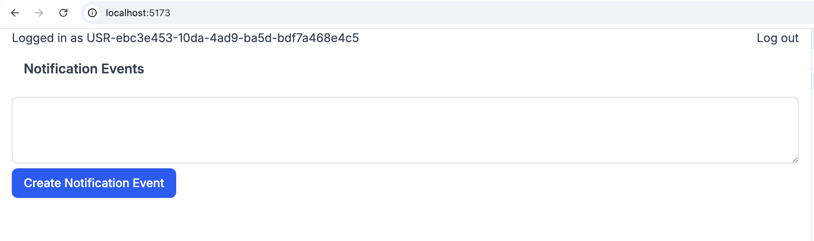
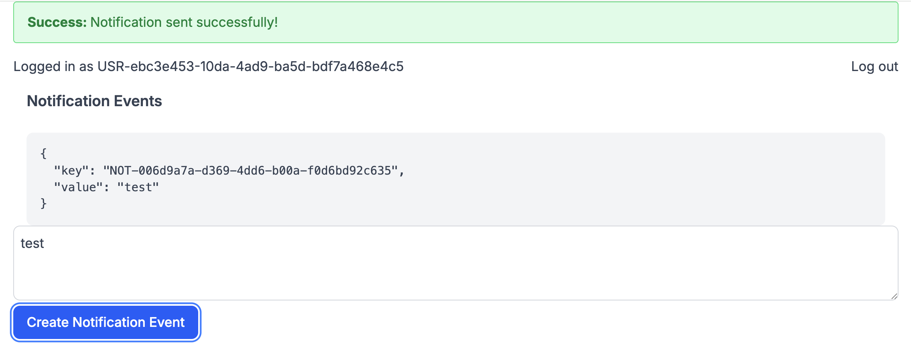

# Notification System

## Install

Checkout the project, then:

```bash
pnpm i
```


## Run it

In one terminal run

```bash
docker compose up
```

In another one run: 

```bash
pnpm dev
```
then point your browser to: 

```http://localhost:5173/```

([link](http://localhost:5173/))


 You can get all the sent events with the API: `http://localhost:3000/api/notifications`


## Test

While you are running ```pnpm dev``` you can run tests and typecheck with:

```bash
pnpm all
```

You can also run them separately with

```bash
pnpm typecheck
```

or

```bash
pnpm test
```


## Some app screenshots

### Home Page:



#### Send Empty Message:


### Send Successfully a message:

After the message is sent, the Event is automatically displayed.



## Architectural choices


This is a monorepo with 2 apps, 
 - ```@repo/web``` -> a react router frontend with a simple demo 
 - ```@repo/backend``` -> an express API providing the notification system API. 


The backend contains 2 modules, in real scenarios those modules would be microservices and I would have an API gateway in front of them. 

### Modules:
- `notifications` -> allows users to send notifications. It also allows users to create a Server Side Event stream to listen for notifications

- `users` -> A simple REST API to get and create users in the system


### Architectural Diagram

- A Server Side Events stream can be created with a simple `POST /api/notifications/session`. The client will now receive all the pertinent events in that session

- A notification can be created with just a simple POST /api/notifications request. 
    - The client is creating a key with a uuid and defining the `userId` the messages need to be delivered to and the `channel` (`APP`| `EMAIL`) the message needs to use
    - The Server is going to produce a kafka event.

- There's a kafka consumer which is going to listen for all the notifications events with channel `APP`. For every event, it will notify the related SSE streams.

#### About kafka-based fan out: 

Fan out logic has slightly different implementation based on the channel type. In this example, I implemented it like this: 

```typescript
   const kafkaAppConsumerId = crypto.randomUUID()
    const notificationsConsumerAppChannel = new Consumer({
        groupId: `notifications-consumer-group-app-${kafkaAppConsumerId}`,
        clientId: 'notifications-consumer',
        bootstrapBrokers: ['localhost:9092'],
        deserializers: stringDeserializers
    })

    const notificationsConsumerEmailChannel = new Consumer({
        groupId: `notifications-consumer-group-email`,
        clientId: 'notifications-consumer',
        bootstrapBrokers: ['localhost:9092'],
        deserializers: stringDeserializers
    })
```

In this way, in a context where we have multiple instances of this service running, every single SSE stream listening for APP notification will be notified, while only 1 mail is going to be sent per user 


## What I would have done with more time. 

- I would have had more type safety, especially in the network communication, using libraries like `ts-rest`.
- More tests.
- I would have moved types and SDKs in different monorepo packages, in general you want to minimize the risk that some nodejs library gets exported in some packages that are supposed to be used in the browser.
- The actual email send is missing. What is needed here is to fetch the email querying via HTTP the user module and then try to use the mail service. 
- There's no userId validation across the API
- There's no actual login in the web UI, I just mocked a user
