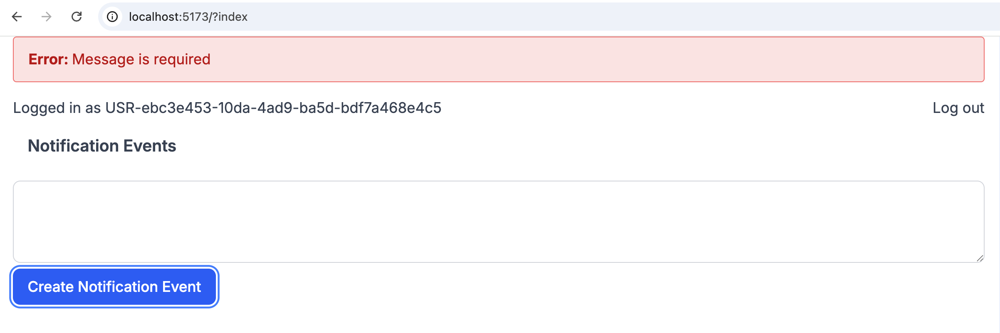

# Notification System

## Install

Checkout the project, then:

```bash
pnpm i
```

then point your browser to: 

```http://localhost:5173/```

([link](http://localhost:5173/))


## Run it

in one terminal run

```bash
docker compose up
```

in another one run: 

```bash
pnpm dev
```


## Test

while you are runing ```pnpm dev``` you can run tests and typecheck with:

```bash
pnpm all
```

You can also run them separatly with

```bash
pnpm typecheck
```

or

```bash
pnpm test
```


## Some app screenshost

### Home Page:


#### Send Empy Message:



### Send Successfully a message:

After the message is sended, the Event is automatically displayed.


## Architectural choices


This is a monorepo with 2 apps, 
 - ```@repo/web``` -> a react router frontend with a simple demo 
 - ```@repo/backend``` -> an express api providing the notification system api. 


the backend contains 2 modules, in a real scenarios those modules would be microservices and I would have an api gateway in front of them. 

### Modules:
- `notifications` -> is allows user to send a notifications. it also allows users to create a Server Side Event stream to listen for notifications

- `users` -> A simple resp api to get and create users in the system


### Architectureal Diagram

- a Server Side Events stream can be created with a simple `GET /api/notifications/session`. the client will now receave all the pertinent events in that session

- a notification can be created with just a simple POST /api/notifications request. 
    - The client is creating a key with a uuid and defining the `userId` the messages need to be delivered to and the `channel` (`APP`| `EMAIL`) the message need to use
    - The Server is gonna produce a kafka event.

- there's a kafka consumer which is gonna listen for all the notifications event with channel `APP`. for every event, it will notifiy the related SSE streams.


## What I would have done with more time. 

- I would have had more typesafety, expecially into the network comunication,  using libraries like `ts-rest`.
- More tests.
- I would have moved types and sdks in different monorepo package, in general you want to minimize the risk that some nodejs library got exported in some packages that are supposed to be used in the browser.


